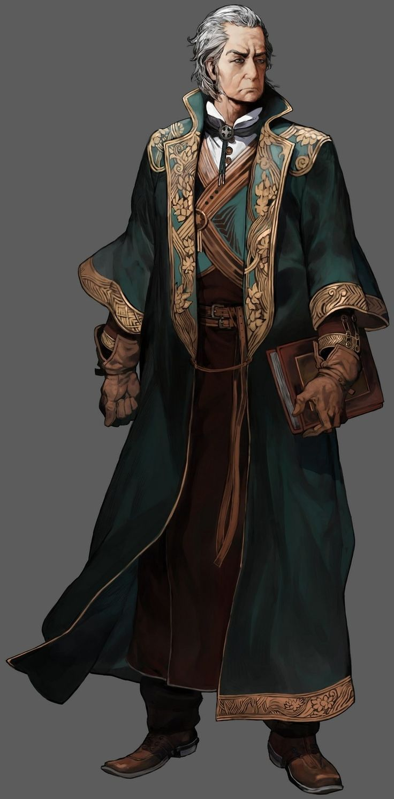

# Les bases

Un personnage est extrêmement important pour le JDR, c'est grâce à lui que vous pourrez jouer et participer à des campagnes.

Tous personnages se sont inscrit à "La compagnie d'aventure", celle-ci est une association importante des 5 royaumes qui permet à tout civil ou plus de proposer des quêtes. Les royaumes et agent de la paix l'utilisent souvent pour se débarrasser des sales corvées dangereuses (Donjons, Sectes, etc.).

### Lors de la création de votre personnage,

vous devrez utiliser le document suivant : [CLIQUEZ-ICI](https://docs.google.com/document/d/1aFlMIZ\_FLbbyWOdB6MKF6K\_H0jE\_PzwNevhnRF-K504/edit?usp=sharing)

Ce document est constitué de plusieurs partis :

* Statistique et identité du personnage
* Informations du personnage
* Éléments du personnage

Un guide et des informations sur les éléments de la fiche sont aussi disponibles à la fin de celle-ci.

Pour créer votre fiche, faite une copie de celle-ci, est partagé là avec L'ÉDITION à l'e-mail : mathis.150.online@gmail.com

### Quels sont les éléments importants pour créer son personnage ?

Il existe plusieurs catégories d'informations importantes pour créer son personnage, dans l'ordre, il y a :&#x20;

* Définir la race et la classe du personnage
* Définir les statistiques du personnage (Vitalité, Force, etc.)
* Définir l'histoire du personnage.

### Pourquoi définir la race et la classe du personnage en premier ?

La race du personnage est la fondation la plus importante de votre personnage, il va quasiment tout définir de votre histoire, son commencement, comme sa suite.

La classe du personnage est une construction qui s'appuie sur sa base, c'est pour cela qu'il est important d'avoir une base solide. La classe va définir vos objectifs et ce que vous poursuivez dans vos aventures.

Mais il y a une chose qui rassemble ses deux informations plus que l'histoire de votre personnage : **Les statistiques ajoutées à votre personnage.**

Ils sont un plus qui permet d'appuyer votre utilité dans un groupe ! Avoir une bonne capacité en force vous permet d'être un bon combattant au corps à corps, avoir beaucoup de vie permet d'être un bouclier pour protéger vos allier, avoir beaucoup de magie vous permet de soutenir vos alliés, etc.

### Définir vos statistiques

Bravo ! Vous avez construit les bases de votre personnage, maintenant, voyons comment marchent les statistiques et comment les définir au début de votre aventure.

Pour cela, je vais prendre un exemple de personnage fictif que l'on pourrait créer :&#x20;

<figure><figcaption>
Je vous présente Bernard, un humain avec magie de classe Mage.
</figcaption></figure>

Comme vous le voyez, j'ai "créé" un personnage qui se nomme Bernard, un humain avec magie.

Que pouvons-nous dire de lui ? Déjà, il a des statistiques en plus par rapport à sa race :&#x20;

* (+) 5 points de psychologie
* (+) 10 % de charisme
* (+) 5 % de dextérité
* (+) 10 % de courage
* (+) 5 % de sagesse
* (+) 10 % d'intelligence
* (+) 5 % de constitution mentale

Ensuite, ceux par rapport à sa classe :&#x20;

* (+) 5 points de psychologie
* (+) 15 points d'énergie magique
* (+) 10 points d'énergie originelle
* (-) 10 % de force
* (-) 5 % de constitution physique
* (+) 10 % de charisme
* (+) 5 % de dextérité
* (+) 10 % de sagesse
* (+) 5 % d'intelligence
* (+) 5 % de constitution mentale

Qu'est-ce que tout cela signifie ? Ce sont des bonus ou débuf en fonction des classes ajoutée à vos statistiques après avoir fait un jet de dés qui les définis.

Parlons désormais des jets de dés. Il y a un ordre précis à faire pour chaque jet de dés.


**La commande qui permet d'effectuer un jet de dés est :**&#x20;

* !r {Nb. de dés}d{Nb. de face}



**Il existe des jets de dés prédifinie pour définir vos statistiques de base :**&#x20;

* Vitalité : {1d50}
* Points de psychologie : {1d30}
* Points d'énergie magique : {1d50}
* Points d'énergie originelle : {1d20}
* Les 8 sous-statistiques : {8d80}



**Bon à savoir:**

Toutes sous-statistiques au dessus de 80 ce verras limité à se nombre, est une variante sera stocké à côté.

Vous pourrez faire que cette variante devient la vrai statistique si vous faite un jet de dés de "1" de la dite statistique entièrement naturelle.

Les statistiques ne pourrons pas dépasser 95 en variante.

Sachez aussi que, le résultat du {8d80} donneras 8 nombres, que vous pourrez avoir la liberté de répartir comme vous le souhaitez.



**Bon à savoir :**&#x20;

À savoir, tout jet de dés en dessous ou égal à 5 vous fera relancer automatiquement. Toutes statistiques finals en dessous ou égal à 5 vous fera relancer automatiquement.


Maintenant, imaginons que je fais mes jets de dés :&#x20;

* Je lance 1d50 qui définie mes points de vie, j'obtiens "29", je n'ai aucun buff ou débuff, j'ai donc 29 points de vie de départ.
* Je lance 1d30 pour définir mes points de psychologie, j'obtiens "12", j'ai 10 points supplémentaires, cela m'emmène à 22 points.
* Je lance à nouveau 1d50 qui définit mon énergie magique, j'obtiens "2", je dois donc relancer, et j'obtiens "43", j'ai 15 points d'énergie magique supplémentaire, j'ai donc 58 d'énergie magique.
* ...


**Définir votre type d'énergie orginelle :**&#x20;

Pour ça, faite {1d6} :

* 1 = Feu
* 2 = Eau
* 3 = Terre
* 4 = Électricité
* 5 = Vent
* 6 = Vitalité



**Définir votre endurance :**&#x20;

Pour ça, faite {1d4} :&#x20;

* 1 = Très mauvaise
* 2 = Mauvaise
* 3 = Bonne
* 4 = Très bonne


### Définir votre histoire et votre lore

C'est la partie la plus compliquée, elle vous demandera de vous servir du wiki au maximum, mais aussi, de demander de l'aide au MJ pour toutes questions de cohérence et connaissance du lore.

Le MJs sera en droit de vous refuser votre personnage si celui-ci ne correspond pas aux valeurs du RP ou ne respecte pas le lore. (Ça ne signifie pas que le personnage est à jeter, vous pouvez apporter les modifications demander pour le faire valider à nouveau)

Bonne chance à vous, aventurier !
