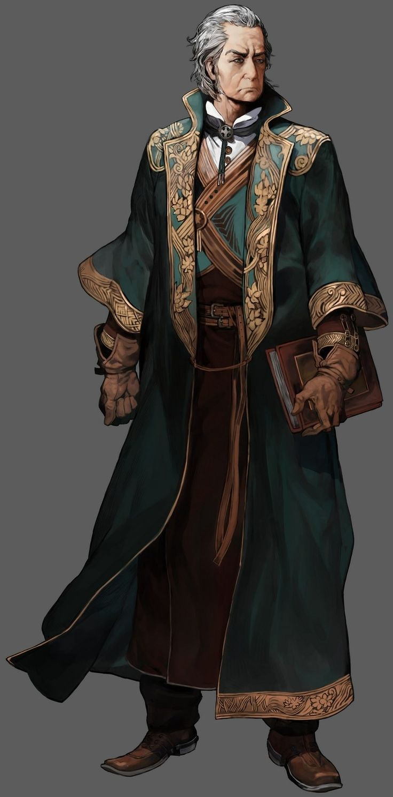

# Humain avec magie

<figure><figcaption>
Exemple d'Humain capable d'utiliser la magie
</figcaption></figure>

Ce type d'humain est capable d'utiliser la magie, il a appris à l'utiliser toute sa vie, le renforçant sûr ce point.

<table><thead><tr><th width="247" align="right">Charactéristique</th><th>Ce qu'ajoute ou retire la race.</th></tr></thead><tbody><tr><td align="right">Points de vie</td><td>(+) 0 points</td></tr><tr><td align="right">Points de psychologie</td><td>(+) 5 points</td></tr><tr><td align="right">Énergie magique</td><td>(+) 0 points</td></tr><tr><td align="right">Énergie originelle</td><td>(+) 0 points</td></tr><tr><td align="right">Points de contrat</td><td>(+) 0 points</td></tr><tr><td align="right">Force</td><td>(+) 0 %</td></tr><tr><td align="right">Constitution Physique</td><td>(+) 0 %</td></tr><tr><td align="right">Charisme</td><td>(+) 10 %</td></tr><tr><td align="right">Dextérité</td><td>(+) 5 %</td></tr><tr><td align="right">Courage</td><td>(+) 10 %</td></tr><tr><td align="right">Sagesse</td><td>(+) 5 %</td></tr><tr><td align="right">Intelligence</td><td>(+) 10 %</td></tr><tr><td align="right">Constitution Mental</td><td>(+) 5 %</td></tr></tbody></table>

Un humain magique a appris à contrôler la magie, et a appris les bases et quelques domaines avancés de la magie, le renforcent légèrement au niveau du mental.

En tant qu'être contrôlant la magie, ses paroles sont beaucoup plus prises au sérieux, même s'il n'est pas le plus sage des êtres.

|                                                                          Don Racial                                                                         |
| :---------------------------------------------------------------------------------------------------------------------------------------------------------: |
| L'Humain avec magie est capable de plus facilement ressentir le danger que les autres espèces, cela lui permet un taux de survie plus élevé que les autres. |

Le don racial est un élément central de chaque race qui l'aide à s'améliorer. Celui-ci est déconseillé d'être mis de côté, car cela pourrait poser d'énorme problème d'équilibrage pour cette personne à force de monter en niveau.

Les dons raciaux ont la particularité d'offrir des compétences au joueur, voici celle de l'homme avec magie :

<table><thead><tr><th width="160" align="right">Compétences</th><th width="153" align="right">LV. Compétence</th><th width="179" align="center">Niveau et jet de dés</th><th>Description</th></tr></thead><tbody><tr><td align="right">Détection du danger</td><td align="right">1</td><td align="center">LV.1 et aucun</td><td>Permet de ressentir, autour de sois et à une petite échelle, le danger.  [LV.1, permet d'être prévenue du danger sur 5m.]</td></tr><tr><td align="right"></td><td align="right">2</td><td align="center">LV.10 {1d100} &#x3C; {Stat. De courage}</td><td>Permet de ressentir, autour de sois et à une échelle moyenne, le danger.  [LV.2, permet d'être prévenue du danger sur 10m.]</td></tr><tr><td align="right"></td><td align="right">3</td><td align="center">LV.20 {1d100} &#x3C; {Stat. De courage}</td><td>Permet de ressentir, autour de sois et à une grande échelle, le danger.  [LV.3, permet d'être prévenue du danger sur 20m.]</td></tr><tr><td align="right"></td><td align="right"></td><td align="center"></td><td></td></tr><tr><td align="right">Instincts primaires</td><td align="right">1</td><td align="center">LV.1 et aucun</td><td>Ne fait rien.  [LV.1, Ne fait rien.]</td></tr><tr><td align="right"></td><td align="right">2</td><td align="center">LV.15 {1d100} &#x3C; {Stat. D'intelligence}</td><td>
Il vous permet, quand vous êtes en danger, de devenir plus puissant.

[LV.2, Augmente votre force, votre constitution physique et votre dextérité de 5. Vous recevez 30 d'énergie magique en plus.]
</td></tr><tr><td align="right"></td><td align="right">3</td><td align="center">LV.35 {1d100} &#x3C; {Stat. D'intelligence}</td><td>Vous devenez un maître dans votre Classe.  [LV.3, Augmente de 5 chaque élément statistique de votre classe.]</td></tr></tbody></table>

Bon jeu à vous, aventurier.
