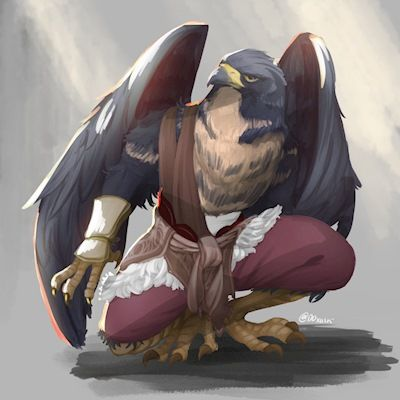

# Type Hippogriffe

<figure><figcaption>
Exemple d'hybride Hippogriffe.
</figcaption></figure>

L'Hippogriffe est une créature LÉGENDAIRE du bestiaire "d'Esprit du Dragon".

Un homme bête de la race de l'Hippogriffe sont reconnaissables par leurs tailles plus hautes, en moyenne, que celle d'un humain, mais aussi, de leurs corps rappelant clairement des oiseaux.

L'Hippogriffe est reconnu comme une sorte d'oracle au sein des races. Il est l'une des rares races à pouvoir prévoir, dans les grandes lignes, le futur.

<table><thead><tr><th width="247" align="right">Charactéristique</th><th>Ce qu'ajoute ou retire la race.</th></tr></thead><tbody><tr><td align="right">Points de vie</td><td>(+) 10 points</td></tr><tr><td align="right">Points de psychologie</td><td>(+) 15 points</td></tr><tr><td align="right">Énergie magique</td><td>(+) 30 points</td></tr><tr><td align="right">Énergie originelle</td><td>(+) 15 points</td></tr><tr><td align="right">Points de contrat</td><td>(+) 5 points</td></tr><tr><td align="right">Force</td><td>(+) 5 %</td></tr><tr><td align="right">Constitution Physique</td><td>(+) 0 %</td></tr><tr><td align="right">Charisme</td><td>(+) 10 %</td></tr><tr><td align="right">Dextérité</td><td>(-) 10 %</td></tr><tr><td align="right">Courage</td><td>(+) 0 %</td></tr><tr><td align="right">Sagesse</td><td>(+) 5 %</td></tr><tr><td align="right">Intelligence</td><td>(+) 5 %</td></tr><tr><td align="right">Constitution Mental</td><td>(+) 5 %</td></tr></tbody></table>

Les hippogriffes ont un corps assez bon sur la plupart des aspects.

Leurs charismes étant assez imposants par le fait qu'ils sont vénérés.

|                                                                                       Don Racial                                                                                      |
| :-----------------------------------------------------------------------------------------------------------------------------------------------------------------------------------: |
| L'Hippogriffe a pour particularité d'être capable de voir à travers le futur, dans les grandes lignes, mais aussi, d'utiliser ses grandes ailes pour préparer des attaques aériennes. |

Le don racial est un élément central de chaque race qui l'aide à s'améliorer. Celui-ci est déconseillé d'être mis de côté, car cela pourrait poser d'énorme problème d'équilibrage pour cette personne à force de monter en niveau.

Les dons raciaux ont la particularité d'offrir des compétences au joueur, voici celle de l'homme bête type "Hippogriffe" :

<table><thead><tr><th width="160" align="right">Compétences</th><th width="153" align="right">LV. Compétence</th><th width="179" align="center">Niveau et jet de dés</th><th>Description</th></tr></thead><tbody><tr><td align="right">Oracle</td><td align="right">1</td><td align="center">LV.1 et aucun</td><td>Au niveau 1, vous ne contrôlez pas votre pouvoir de vision.  [LV.1, obtention du sort "Oracle" au niveau 1.]</td></tr><tr><td align="right"></td><td align="right">2</td><td align="center">LV.5 {1d100} &#x3C; {Stat. D'Intelligence}</td><td>Au niveau 2, vous êtes capable de contrôler l'arrivée de vos visions  [LV.2, obtention du sort "Oracle" au niveau 2.]  {25 d'énergie magique}</td></tr><tr><td align="right"></td><td align="right">3</td><td align="center">LV.30 {1d100} &#x3C; {Stat. D'Intelligence} / 2</td><td>
Au niveau 3, vous êtes capable de mieux comprendre les visions.  [LV.2, obtention du sort "Oracle" au niveau 3.]

 {40 d'énergie magique}
</td></tr><tr><td align="right"></td><td align="right"></td><td align="center"></td><td></td></tr><tr><td align="right">Aile d'hippogriffe</td><td align="right">1</td><td align="center">LV.1 et aucun</td><td>Au niveau 1, ils sont incapables d'utiliser leur capacité.</td></tr><tr><td align="right"></td><td align="right">2</td><td align="center">LV.3 {1d100} &#x3C; {Stat. De Force}</td><td>Au niveau 2, ils sont capables de voler dans les airs, mais pas de faire des actions complexes.  [LV.2, la compétence permet de voler dans les airs pour observer les alentours et faire des déplacements simples.]</td></tr><tr><td align="right"></td><td align="right">3</td><td align="center">LV.15 {1d100} &#x3C; {Stat. De Force}</td><td>Au niveau 3, ils sont capables d'effectuer des actions complexes dans les airs  [LV.2, la compétence permet de voler en total liberté.]</td></tr></tbody></table>

Bon jeu à vous, aventurier.
