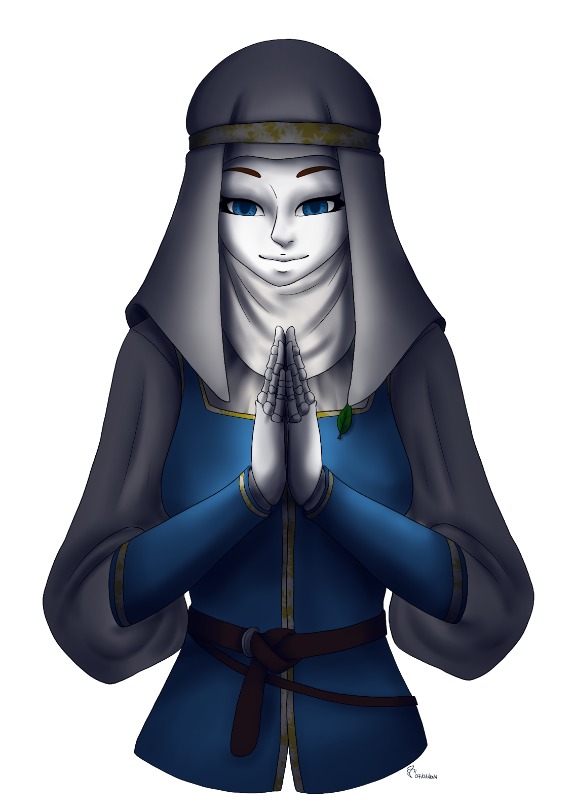

# Poupée Animé

<figure><figcaption>
Exemple de poupée animé. (Personnage et dessin, par Ashley Wilson)
</figcaption></figure>

Les Poupées animées sont des êtres artificiels créés par des mages d'une très grande puissance, capable d'effectuer des enchantements d'une complexité extrême.

Ils peuvent être de matière différente, mais seront toujours articulés, auront toujours un stockage artificiel de magie, et dépendrons toujours de leurs points de contrat.

Si leurs points de contrat (Si le créateur de la poupée l'a défini comme telle) ou leurs magies tombent à 0, ils peuvent finir par être désactivé.

<table><thead><tr><th width="247" align="right">Charactéristique</th><th>Ce qu'ajoute ou retire la race.</th></tr></thead><tbody><tr><td align="right">Points de vie</td><td>(+) 15 points</td></tr><tr><td align="right">Points de psychologie</td><td>N'AS AUCUN POINT</td></tr><tr><td align="right">Énergie magique</td><td>(+) 50 points</td></tr><tr><td align="right">Énergie originelle</td><td>N'AS AUCUN POINT</td></tr><tr><td align="right">Points de contrat</td><td>(+) 10 points</td></tr><tr><td align="right">Force</td><td>(+) 5 %</td></tr><tr><td align="right">Constitution Physique</td><td>(+) 20 %</td></tr><tr><td align="right">Charisme</td><td>(-) 10 %</td></tr><tr><td align="right">Dextérité</td><td>(+) 0 %</td></tr><tr><td align="right">Courage</td><td>(+) 20 %</td></tr><tr><td align="right">Sagesse</td><td>(+) 0 %</td></tr><tr><td align="right">Intelligence</td><td>(+) 0 %</td></tr><tr><td align="right">Constitution Mental</td><td>(+) 20 %</td></tr></tbody></table>

Les poupées animées n'ont aucun besoin psychologique, les rendant extrêmement résistantes aux attaques qui y touche.

De plus, ils ont une excellente résistance physique, dû au fait qu'il ne ressente pas la douleur. Les réparer reste difficile, et des sorts de soins spécifiques seront nécessaires pour les réparer (Telle que des sorts de reconstitution.)\
\
Les potions ne fonctionnent pas sur eux. Des sorts de construction peuvent aider à les réparer.

|                                                                    Don Racial                                                                   |
| :---------------------------------------------------------------------------------------------------------------------------------------------: |
| La poupée animée peut, en évoluant, utiliser la volonté de son créateur (Le joueur) pour devenir plus puissante en fonction de sa dite volonté. |

Le don racial est un élément central de chaque race qui l'aide à s'améliorer. Celui-ci est déconseillé d'être mis de côté, car cela pourrait poser d'énorme problème d'équilibrage pour cette personne à force de monter en niveau.

Les dons raciaux ont la particularité d'offrir des compétences au joueur, voici celle de la poupée animée :

<table><thead><tr><th width="160" align="right">Compétences</th><th width="153" align="right">LV. Compétence</th><th width="179" align="center">Niveau et jet de dés</th><th>Description</th></tr></thead><tbody><tr><td align="right">Volonté du créateur</td><td align="right">1</td><td align="center">LV.1 et aucun</td><td>Au niveau 1, vous ne possédez rien pour le moment.</td></tr><tr><td align="right"></td><td align="right">2</td><td align="center">LV.5 {1d100} &#x3C; {Stat. De Constitution Mental}</td><td>Au niveau 2, une fois par campagne, vous pouvez booster une statistique de 15%, et un sortilège pour qu'il soit 2x plus efficace.  [LV.2, buff disponible à chaque quête.]</td></tr><tr><td align="right"></td><td align="right">3</td><td align="center">LV.15 {1d100} &#x3C; {Stat. De Constitution Mental} / 2</td><td>Au niveau 3, une fois par campagne, vous pouvez booster deux statistiques de 15%, et deux sortilèges pour qu'il soit 2x plus efficace. Cela peut être aussi appliqué sur un allié.  [LV.2, buff disponible à chaque quête.]</td></tr></tbody></table>

Bon jeu à vous, aventurier.
