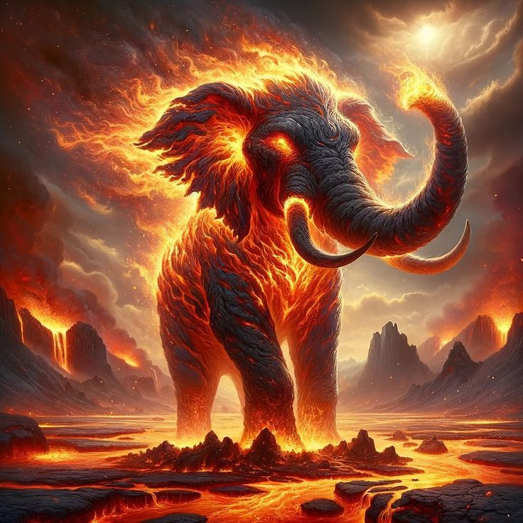

# Éléphant enflammé

<figure><figcaption>
Une représentation de la créature
</figcaption></figure>

**Nom :** Éléphant enflammé, "Roi des volcans"

**Dangerosité :** Danger Orange (★★★★✩)

**Niveau :** 15 -> 35

**Type de compagnon :** Aide combattant

**Description :**&#x20;

L'éléphant enflammé ou "Roi des volcans" est un éléphant de 5 mètres, entièrement enflammé, et pleure de la lave.

Lors de votre affrontement contre cette créature, vous devrez rester sur vos gardes sur son immensité et sa grande résistance. Les coups physiques sans armes sont fortement déconseillés.

On retrouve cet animal principalement dans les montagnes, principalement volcanisés.
